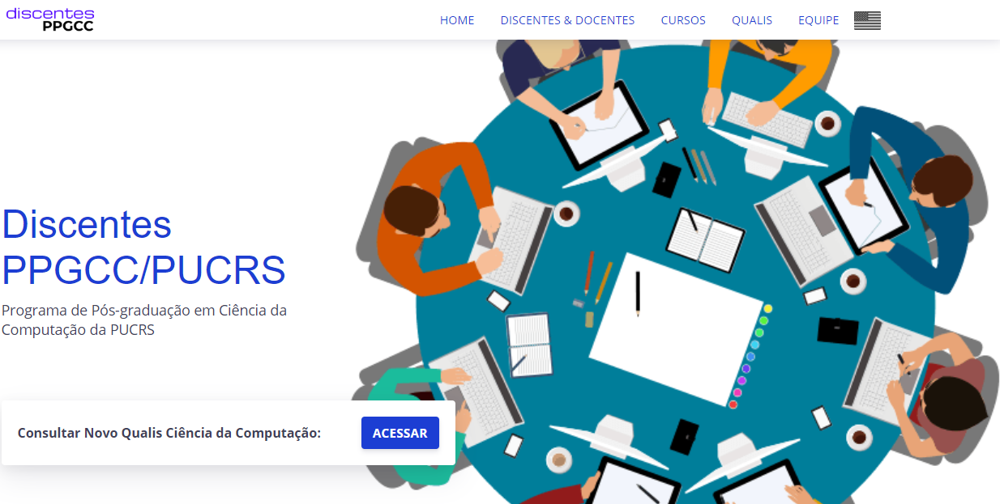
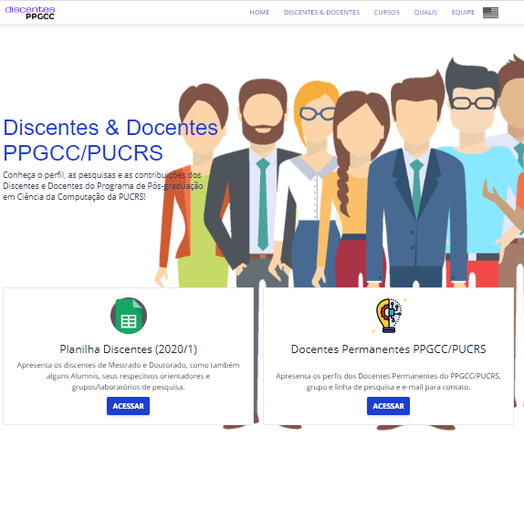
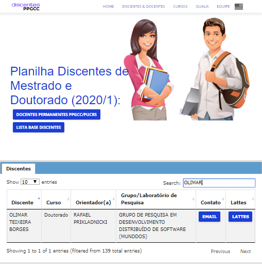
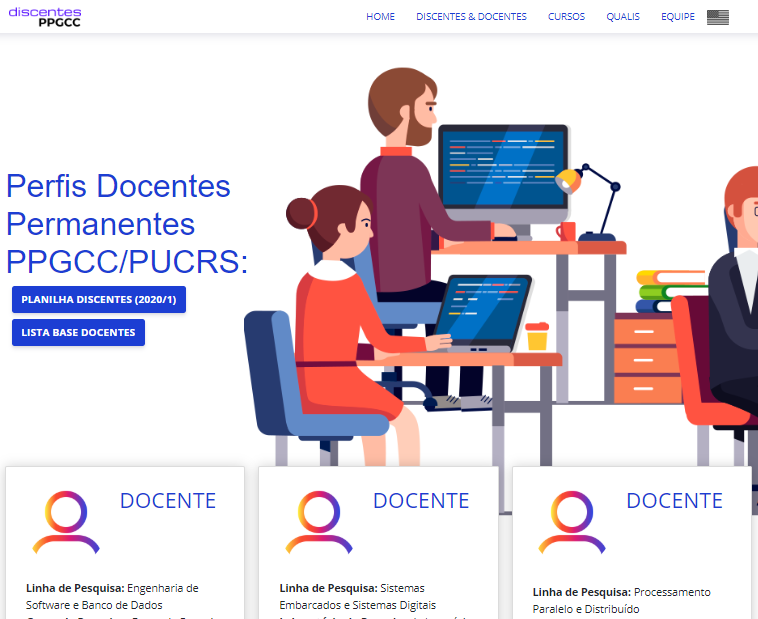
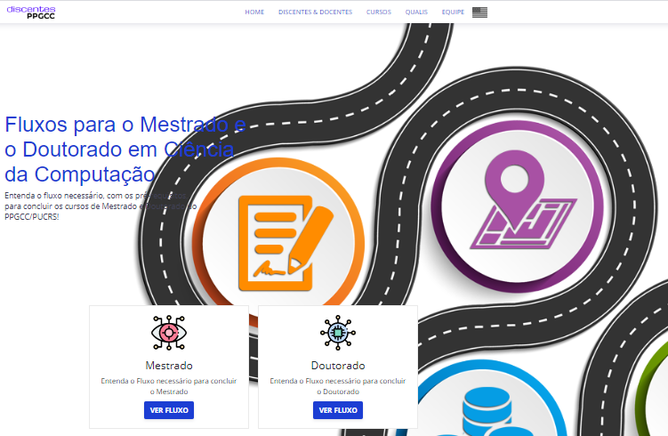
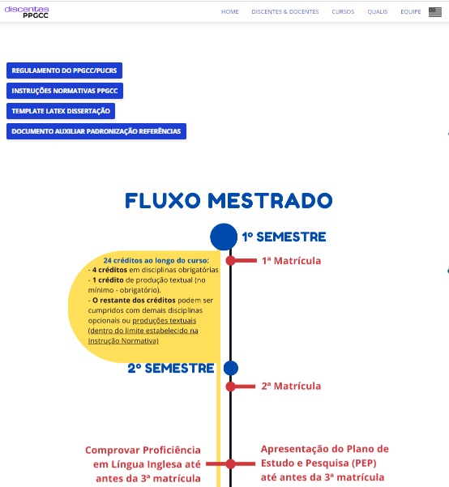
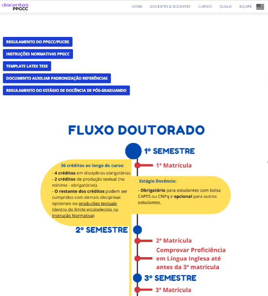
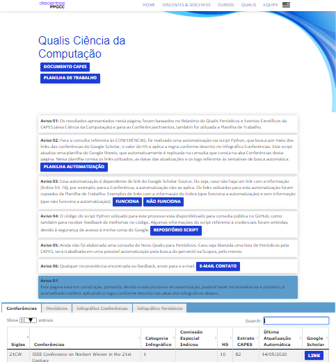
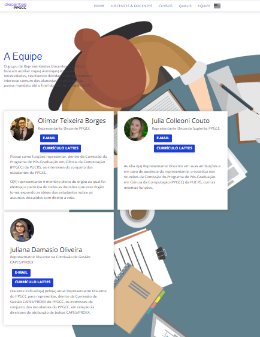

# Discentes PPGCC/PUCRS

Este projeto é uma iniciativa da gestão do atual Representante Discente do Programa de Pós-graduação em Ciência da Computação (PPGCC/PUCRS) **[Olimar Teixeira Borges](https://github.com/olimarborges)**, que visa organizar e centralizar algumas das principais informações relacionadas ao programa, seus cursos, docentes e discentes.

O principal objetivo deste site é informar os discentes do PPGCC, como também, pessoas que estejam interessadas em entrar em algum dos cursos. Aqui serão apresentadas as informações mínimas dos docentes do programa, para que os(as) alunos(as) possam fazer contato com os(as) professores(as) e que também conheçam os integrantes de cada grupo/laboratório de pesquisa.

- O site possui uma versão com as mesmas funcionalidades, no idioma inglês. Basta selecionar o botão da bandeira americana para fazer a troca de idioma. Essa funcionalidade serve, principalmente, para que pessoas estrangeiras que queiram conhecer melhor o programa ou até mesmo se tornar aluno(a), também possam entender o seu funcionamento.

- O site está acessível para pessoas com deficiência visual, que façam uso de interpretadores de tela. Todas as imagens possuem uma breve descrição sobre o seu significado, para um melhor entendimento do seu contexto.

- O site também possui configurado o Google Analytics, para que seja possível verificar as páginas e links mais acessados. Esta funcionalidade servirá para entender a utilização do site e para futuras manutenções.

## Estrutura do Conteúdo

- **HOME**: Página incial do site.
- **DISCENTES & DOCENTES**: Página com o direcionamento para as informações dos discentes e docentes.
- **CURSOS**: Página com o direcionamento para os fluxos necessários, com os pré-requisitos, para concluir os cursos de Mestrado e Doutorado do PPGCC/PUCRS!
- **QUALIS CC**: Página criada para a consulta do novo qualis da CAPES.
- **EQUIPE**: Página com as informações da atual gestão de representantes discentes.

## Principais Funcionalidades

O site é composto por algumas funcionalidades de interesse discente. Estas informações foram interamente baseadas nos conteúdos públicos disponibilizados, tanto no site do [PPGCC](http://www.pucrs.br/politecnica/programa-de-pos-graduacao-em-ciencia-da-computacao/), quando no site dos [Pesquisadores PUCRS](http://www.pucrs.br/pesquisadores/). Este site apenas organiza e relaciona estas informações, objetivando uma maior compreensão por parte dos discentes. Nas páginas deste site você irá encontrar:

- **HOME**: Página incial do site, com algumas das informações principais para acesso rápido, como principais links de interesse e informações dos cursos.

- **DISCENTES & DOCENTES**: Página com o direcionamento para as informações dos discentes e docentes. É nesta página que as informações de discentes vs. docentes estão relcionadas. Aqui você poderá encontrar os discentes do PPGCC, seus e-mails para contato, currículo lattes, seus grupos de pesquisa e respectivos(as) orientadores(as). Além disso, esta página também será importante para as pessoas que quiserem entrar em alguns dos cursos, paara que possam conhecer o corpo discente e docente do programa.

  

  - **_Planilha Discentes a partir de (Ano/semestre atual)_**: Apresenta os discentes de Mestrado e Doutorado, como também alguns Alumnis, seus(as) respectivos(as) orientadores(as) e grupos/laboratórios de pesquisa.

  

  - **_Docentes Permanentes PPGCC/PUCRS_**: Apresenta os perfis dos Docentes Permanentes do PPGCC/PUCRS, grupo/linha de pesquisa e e-mail para contato.

  

- **CURSOS**: Página com o direcionamento para os fluxos necessários, com os pré-requisitos, para concluir os cursos de Mestrado e Doutorado do PPGCC/PUCRS. Por meio de `linhas do tempo`, os discentes poderão entender como funciona os fluxos de Mestrado e Doutorado, com informações das principais entregas e pré-requisitos para poder concluir algum dos cursos.

  - **_Mestrado_**: Entenda o Fluxo necessário para concluir o curso de Mestrado.

  

  - **_Doutorado_:** Entenda o Fluxo necessário para concluir o curso de Doutorado.

  

- **QUALIS CC**: Página criada para a consulta do novo qualis da CAPES. Ela ainda está em construção constante, mas já pode ser utilizada para a consulta dos Qualis das Conferências da área da Computação. Leia com atenção os `AVISOS` que constam listados no topo da página. Eles possuem informações e direcionamentos importantes para o uso da planilha de consulta. Nesta página você encontrará uma divisão de quatro abas, com as seguintes informações:
  - **_Conferências_**: Consulta dos qualis das Conferências da área.
  - **_Periódicos_**: Em construção.
  - **_Infográfico Conferências_**: É apresentado o Infográfico com o detalhamento de como aplicar o cálculo do novo qualis para as Conferências, com seus respectivos links que constam mencionados na imagem.
  - **_Infográfico Periódicos_**: É apresentado o Infográfico com o detalhamento de como aplicar o cálculo do novo qualis para os Periódicos, com seus respectivos links que constam mencionados na imagem.

- **EQUIPE**: Página com as informações da atual gestão de representantes discentes, para que seja possível, quando necessário, entrar em contato com algum dos integrantes da representação.

# Aviso Legal

Como já mencionado anteriormente, este site é uma iniciativa discente e não é o site oficial do PPGCC. Qualquer dúvida que surja em relação ao conteúdo publicado aqui ou sugestões de alterações, devem ser encaminhadas ao representante discente atual. As informações do(a) atual representante discente constam na página da Equipe.

# Licença

A base inicial deste template foi utilizada de outro autor e no arquivo LICENSE possui a informação dos direitos autorais (na linha 3) com suas respectivas informações.
